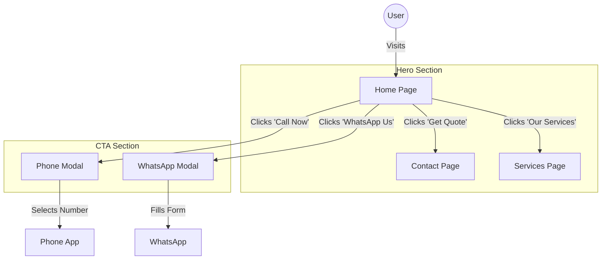
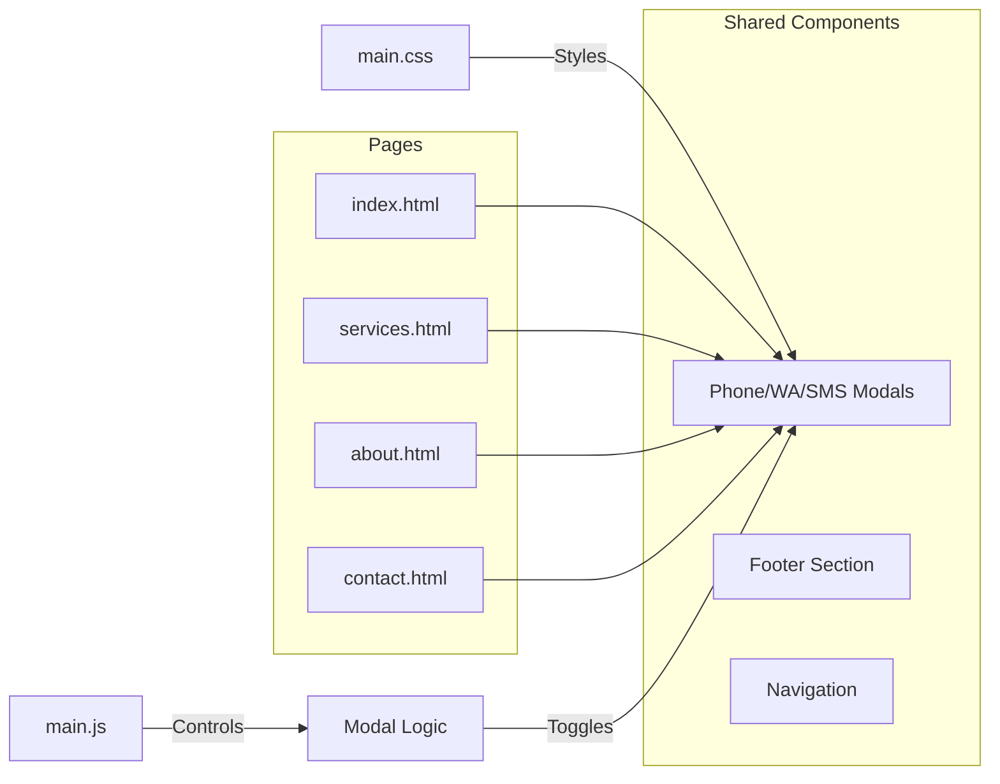

# TotalTech Printer Services Website

This is the source code for the TotalTech Printer Services website. It is a responsive, multi-page website built with HTML, Tailwind CSS, and vanilla JavaScript.

## Features

*   **Responsive Design:** Optimized for desktops, tablets, and mobile devices.
*   **Modern UI:** Clean, professional interface with smooth animations and polished typography.
*   **Interactive Mobile Menu:** Fully functional hamburger menu for mobile navigation.
*   **Service Pages:** Detailed information about printer repair, installation, and maintenance services.
*   **Interactive Modals:** Custom modals for Phone support, WhatsApp communication, and SMS messaging.
*   **Contact Form:** Integrated contact form that redirects to WhatsApp for immediate support.
*   **Starfield Footer Effect:** A unique, non-intrusive animated background in the footer.
*   **Performance:** Lightweight and fast-loading using CDN-hosted assets.

## Recent Updates & Fixes (January 2026)

We have conducted a major maintenance sweep to improve usability and fix critical bugs.

### 1. 🛠️ Critical Bug Fixes
*   **Invisible Loader Overlay:** Fixed a major issue where the page loader (`#page-loader`) remained as an invisible layer (`display: flex !important`) blocking all clicks on the site. Removed the `!important` rule to allow it to hide correctly.
*   **Footer Links:** Resolved z-index layering issues where the animated background was preventing clicks on footer links.
*   **Mobile Menu:** Fixed the hamburger icon animation and toggle functionality.

### 2. 🚀 Feature Enhancements
*   **Interactive Modals:** Replaced static links with interactive modals for a better user experience.
    *   **Phone Modal:** Offers users a choice between Primary and Emergency support numbers.
    *   **WhatsApp Modal:** Pre-fills a support message based on user input.
    *   **SMS Modal:** Allows sending direct SMS messages.
*   **Home Page Hero:**
    *   "Get Quote" button now navigates directly to the Contact page.
    *   "Our Services" button z-index fixed for clickability.
*   **CTA Sections:** "Call Now" and "WhatsApp Us" buttons across all pages now trigger their respective modals.

### 3. 📱 Mobile Navigation & Call Features (Latest Updates)
*   **Mobile Phone Number Display:** Phone number in top bar is now hidden on mobile devices to prevent layout issues and improve mobile experience.
*   **Animated Call Icon:** Added an eye-catching animated phone icon in the top bar next to email address with:
    *   Zoom in/out scaling animation (2-second cycle)
    *   Blinking opacity effect (3-second cycle)
    *   Hover effects for enhanced interactivity
    *   Direct phone call functionality (`tel:` links)
*   **Mobile Navbar Cleanup:** Removed redundant call button from mobile hamburger menu area for cleaner mobile navigation.
*   **Cross-Page Consistency:** All navigation and call features are now consistently implemented across all pages (Home, Services, About, Contact).

## Visual Documentation

### User Interaction Flow
How users interact with the new contact features:

### Project Component Structure
Overview of how the new modals are integrated across the site:

## Project Structure

*   `index.html`: The home page.
*   `services.html`: Details about the services offered.
*   `about.html`: Information about the company, mission, and vision.
*   `contact.html`: Contact information and inquiry form.
*   `assets/`: Directory for images and icons.
*   `main.css`: Custom CSS for animations, modal styling, and overrides.
*   `main.js`: JavaScript core (mobile menu, form handling, loader, modal interactions).

## Setup & Usage

Since this is a static site, no complex build process is required.

1.  **Clone the repository.**
2.  **Open `index.html`** in your web browser.

**Development:**

*   To edit styles, modify `main.css` or add Tailwind classes directly in the HTML.
*   To modify behavior, edit `main.js`.

## Technologies Used

*   **HTML5**
*   **Tailwind CSS** (via CDN)
*   **Remixicon** (for icons)
*   **Vanilla JavaScript**

## License

Copyright © 2026 TotalTech. All rights reserved.
